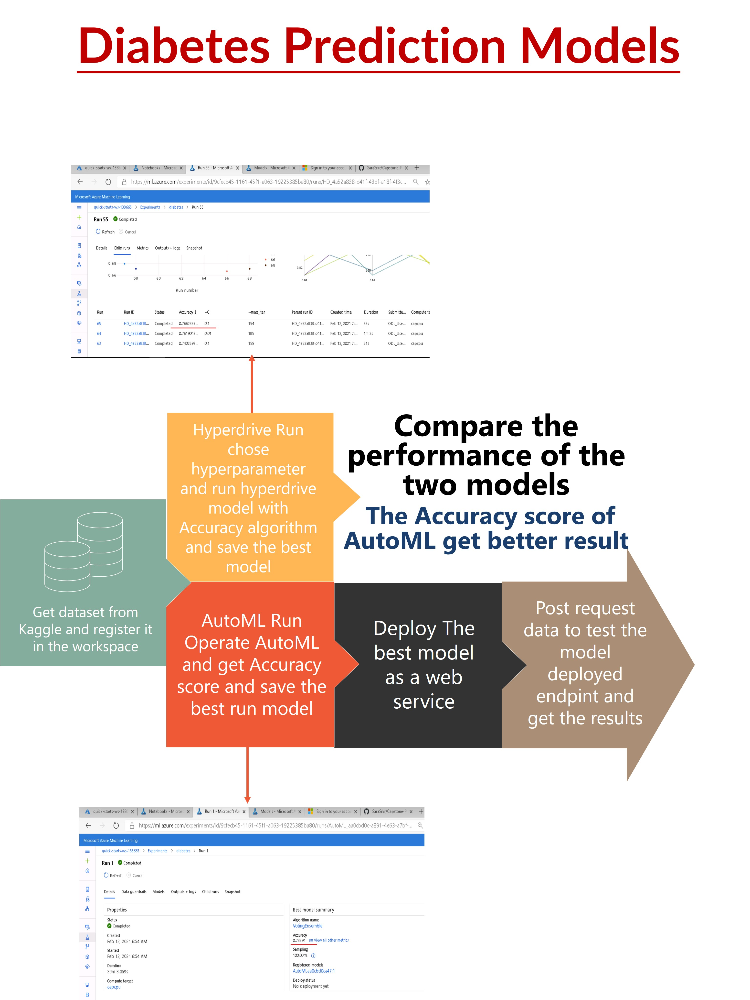

# Dibetes Prediction Models

The project uses external dataset to operate AutoML model classfication and save the best run model from this experiment. Then use the same dataset to operate Hyperdrive model and save best run model from it also. 
The second step is comparing between two final models’ performance and choose the best performance to deploy it as a web service.
The last step is to interact with the deployed  model endpoint and post sample data to test it’s work and receives results.

## Dataset

### Overview
The dibetes dataset from Kaggle. It is consist of 768 records and 9 features whish are Pregnancies,	Glucose, BloodPressure, SkinThickness,	Insulin,	BMI	DiabetesPedigreeFunction,	Age, Outcome
https://www.kaggle.com/saurabh00007/diabetescsv
  
### Task
The objective is to predict based on diagnostic measurements whether a patient has diabetes or not. 
The Outcome binary result 0 or 1 express if the person has diabetes or not so we will use the other features to predict the Outcome column. 

### Access
The python code will loud data saved in the project folder in my Github account by URL.
Then register the dataset in Azure workspace by python code.  

## Automated ML
The overview of the `automl` settings configuration I used for this experiment
AutoMl experiment to classify the dataset records 
1- Create cluster compute "capcpu">
2- creating the expermint in the folder project and load data to the workspace.
3- Set the outml sitting to "experiment_timeout_minutes": 30
                         "max_concurrent_iterations": 3 used this number of itration to be less than compute nodes
                         "primary_metric" : 'accuracy'
                         task = "classification",
                         label_column_name="Outcome",  
                         
### Results
## The Accuracy of voting enasamble is 0.783
 
  
  ________________________________________________________________________________________________________________________________
  
## The Rundetailes widget of AutoML

________________________________________________________________________________________________________________________________

## The best model of AutoML

________________________________________________________________________________________________________________________________

## Hyperparameter Tuning
Run Hyperdrive model with Logistic Regression using Sklearn with hyperparmeter c: Inverse of regularization strength and max_iter which is the number of iterations through all classes.

# parameter sampler
Chose the random sampling because it more efficient to move randomly over the space than use grid sampling which it has to go through all possible value. Random way allow adding range of parameters and it is better than put specific numbers may they aren’t best choice.

# Early stopping policy
Use BanditPolicy to defined after how much certain number of failures the experiment will stop looking for answers 

### Results
The hyperdrive model Accuracy: 0.7662337662337663 and the parmeters ['--C', '0.1', '--max_iter', '154']

## Hyperdrive rundetails

## Hyperdrive best run id

## Model Deployment
*TODO*: Give an overview of the deployed model and instructions on how to query the endpoint with a sample input.

## Screen Recording
*TODO* Provide a link to a screen recording of the project in action. Remember that the screencast should demonstrate:
- A working model
- Demo of the deployed  model
- Demo of a sample request sent to the endpoint and its response

## Standout Suggestions
*TODO (Optional):* This is where you can provide information about any standout suggestions that you have attempted.
